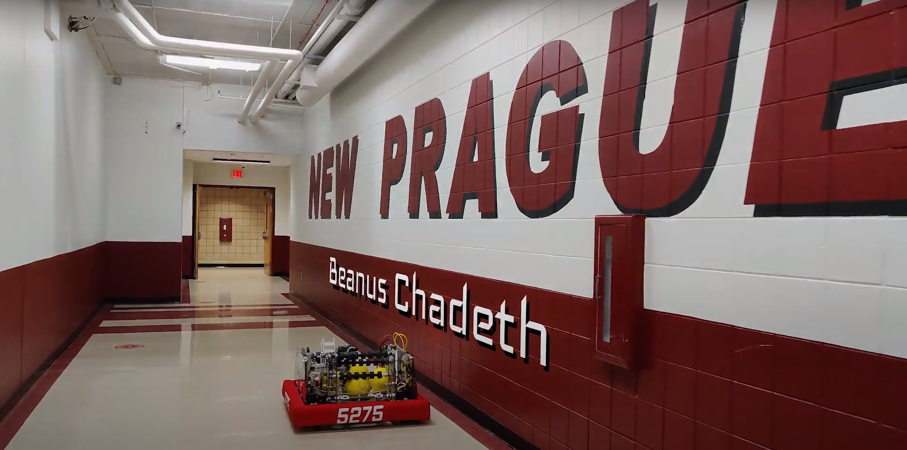

# FRC Team T.I.M.E Bots #5275 - 2021 Robot Code - INFINITE RECHARGE
Contact Us: [our website](https://www.timebots5275.com) | [email](mailto:team@timebots5275.com)  
 

## Robot Information  
First year with Swerve Drive!  
Name: Beanus Chadeth  
Year: 2020-2021  
Team: T.I.M.E Bots 5275  

# 2020-2021 Robot Specifications
[2020-2021 Robot Specifications Google Doc](https://docs.google.com/document/d/1stpTw-b4LB1qDbJboForRVwt5q-sB9sNN-biaHKbk_Q/edit?usp=sharing)

## Subsystems  
| Subsystems | Description         |
| ---------- | ------------------- |
| Drivetrain | Motors: 8 SPARK MAX |
| Intake     | Motors: 1 Talon SRX |
| Hopper     | Motors: 1 Talon SRX |
| Climber    | ...                 |
| Shooter    | Motors: 1 SPARK MAX |

# Code Formatting
All subsystem folders should be lower case.  
All command the folders should be lower case

